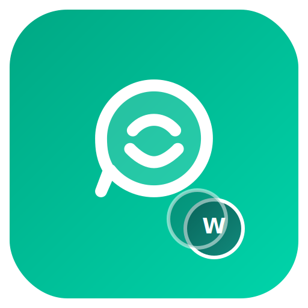

<p align="center">
  
</p>

<h1 align="center">Wapp</h1>

<p align="center">
  <strong>Multi-account WhatsApp Web client for Mac</strong>
</p>

<p align="center">
  <a href="https://github.com/alilibx/wapp/releases"></a>
  <a href="https://github.com/alilibx/wapp/blob/main/LICENSE"></a>
  <a href="https://github.com/alilibx/wapp"></a>
  <a href="https://github.com/alilibx/wapp"></a>
  <a href="https://github.com/alilibx/wapp/stargazers"></a>
</p>

<p align="center">
  Run multiple WhatsApp accounts side-by-side. Toggle the sidebar to focus. Switch between top and side tabs. That's it.
</p>

---

## Features

| | Feature | Description |
|---|---|---|
| **👥** | **Multi-account** | Each account runs in its own isolated session with separate QR login |
| **📌** | **Toggle sidebar** | Hide the WhatsApp chat list to focus on a conversation — press `⌘B` |
| **↔️** | **Flexible tabs** | Switch between top (horizontal) and left (vertical) tab layout |
| **🔄** | **Tab management** | Right-click any tab to rename, reload, or remove it |
| **💾** | **Persistent** | Sessions persist between restarts — no re-scanning QR codes |
| **🍎** | **Native macOS** | Hidden title bar, traffic light controls, native context menus |

## Quick Start

```bash
# Clone
git clone https://github.com/alilibx/wapp.git
cd wapp

# Install
bun install

# Run
bun run start
```

## Build

```bash
bun run build
```

Outputs a `.dmg` in the `dist/` folder.

## Keyboard Shortcuts

| Shortcut | Action |
|:---------|:-------|
| `⌘B` | Toggle WhatsApp sidebar |
| `⌘N` | New account *(planned)* |
| `⌘W` | Close current tab *(planned)* |
| `⌘1-9` | Switch to account by number *(planned)* |

## How It Works

Wapp wraps WhatsApp Web in Electron `<webview>` tags, each with its own [persistent partition](https://www.electronjs.org/docs/latest/api/webview-tag#partition) for complete session isolation. The main process handles native menus and global shortcuts, while a secure `preload.js` bridge connects the renderer UI to the main process via `contextBridge`.

## Project Structure

```
wapp/
├── src/
│   ├── main/
│   │   └── index.js          # Window, IPC handlers, native menus
│   ├── renderer/
│   │   ├── index.html         # App shell
│   │   ├── styles.css         # UI styles
│   │   └── app.js             # Account & tab management
│   └── preload.js             # Secure IPC bridge (contextBridge)
├── assets/                    # Logo & screenshots
├── .github/ISSUE_TEMPLATE/    # Bug report & feature request
├── CONTRIBUTING.md
├── LICENSE                    # MIT
└── package.json
```

## Roadmap

- [ ] Notification badges per account
- [ ] Keyboard shortcuts for tab switching (`⌘1-9`)
- [ ] Drag-to-reorder tabs
- [ ] Custom themes
- [ ] Auto-updater
- [ ] Linux & Windows support

## Contributing

Contributions are welcome! See [CONTRIBUTING.md](CONTRIBUTING.md) for guidelines.

## Disclaimer

Wapp is an independent project and is not affiliated with, endorsed by, or connected to WhatsApp or Meta in any way. WhatsApp is a trademark of Meta Platforms, Inc.

## License

[MIT](LICENSE) — do whatever you want with it.

---

<p align="center">
  <sub>Built with Electron + WhatsApp Web. If you find it useful, <a href="https://github.com/alilibx/wapp">give it a star</a>.</sub>
</p>
